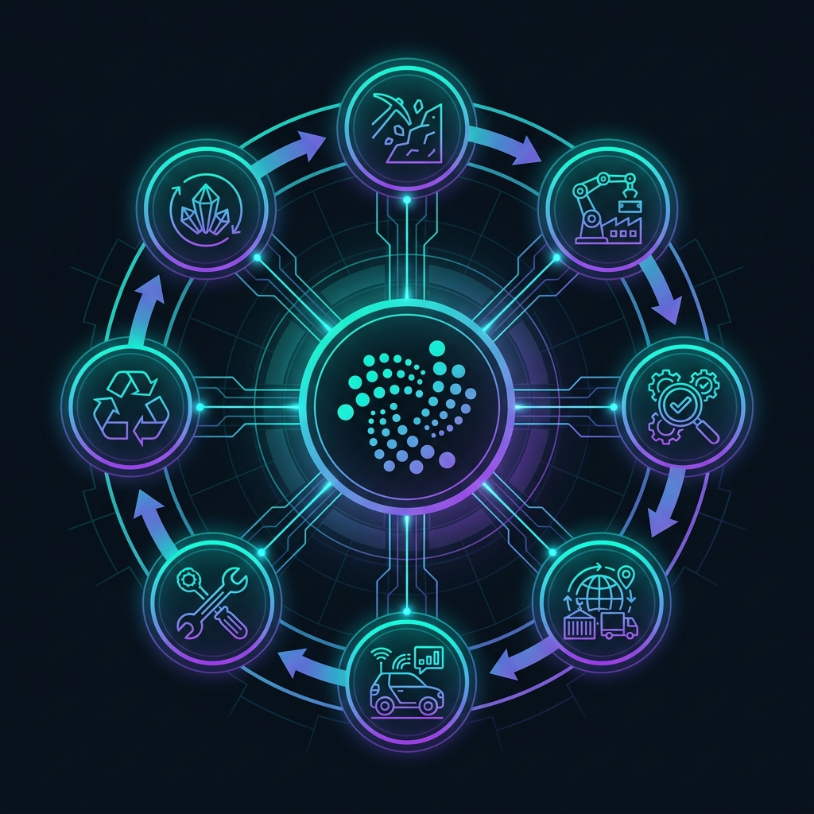
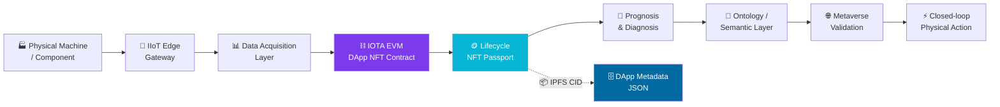

<div align="center">

<!-- Animated Banner — self-hosted SVG (circuit texture, particles, glow, typewriter) -->


<br/>

<!-- Badges -->


<p><b>Bridging Physical Manufacturing with Immutable Web3 Digital Twins</b></p>
<p><i>A cutting-edge NFT-based lifecycle management layer for Semantic Integrated IIoT Manufacturing Systems.</i></p>

</div>

---

## 🧠 What Is This Project?

> **IOTA DApp NFT Lifecycle Management** is a Web3 infrastructure that creates a **permanent, tamper-proof digital identity** for every physical product in a manufacturing ecosystem — stored as an NFT on the **IOTA EVM blockchain**.

Think of it as a **living passport** for industrial assets. Every time a machine component is created, inspected, shipped, maintained, or retired, that event is cryptographically recorded and attached to its NFT. This makes the entire lifecycle of a product:

| Property | Meaning |
|----------|---------|
| 🔒 **Immutable** | Records cannot be altered or deleted after being written |
| 🌐 **Decentralized** | No single company controls the data — it lives on-chain |
| ✅ **Verifiable** | Anyone with the token ID can independently verify history |
| 🔗 **Interoperable** | Works across IIoT, AI, metaverse, and semantic web layers |
| 🌿 **Auditable** | Full traceability for regulatory compliance and carbon tracking |

---

## 💡 Project Summary

This system is built as **Layer 0 of a larger Semantic IIoT Manufacturing Platform** — providing the foundational truth layer that all higher-level services (AI analytics, metaverse validation, autonomous control loops) depend on.

### The Core Problem It Solves

In traditional manufacturing, product lifecycle data is fragmented across:
- 📂 Excel spreadsheets and siloed databases
- 🏭 Proprietary MES/ERP systems that don't talk to each other
- 📄 Paper-based maintenance logs prone to loss or tampering

**This project replaces all of that** with a single, unified, blockchain-anchored NFT that follows the product from raw material extraction to end-of-life disposal.

### How It Works — In Plain Terms

```
🏭 Factory mints an NFT          →  Product gets a unique blockchain identity
⚙️  Machine runs, sensors log    →  IIoT data hash is pinned to NFT on IPFS
🔍 Quality check passes          →  QA result signed and appended to NFT record
🚚 Component ships to OEM        →  Supply chain transfer event recorded on-chain
🛠️  Field maintenance performed  →  Technician logs repair, NFT state updated
♻️  End-of-life reached          →  NFT frozen — no further state changes allowed
```

---

## ✨ Visual Overview

<div align="center">


<!-- NFT Lifecycle Chart -->


<p><i>🔄 NFT Lifecycle Stages — From Raw Material to End of Life on IOTA EVM</i></p>

<br/>

<!-- Architecture Graph -->


<p><i>🏗️ System Architecture — Physical IIoT Devices → IOTA EVM → NFT Digital Passport</i></p>


</div>

---

## 👥 Team

| Name | Role | GitHub |
|------|------|--------|
| Manikant Kumar | Smart Contract & Blockchain | [@manikantbindass](https://github.com/manikantbindass) |
| Abhijeet Ranjan | IIoT Integration & Architecture | [@35qu4r3d](https://github.com/35qu4r3d) |
| Dhruv Maji | dApp Frontend & Documentation | [@Dhruv4848l](https://github.com/Dhruv4848l) |

---

## 📊 Project Position in the Main Workflow

This repository is **one layer** of an 8-layer Semantic IIoT Manufacturing System. Here is where it fits:

| Layer | Main Project Responsibility | How NFTs Connect |
| :---: | --- | --- |
| **1** | Physical manufacturing machines | Product, machine, and part NFTs represent the physical assets |
| **2** | IIoT transformation | Edge gateway identifiers are embedded in NFT metadata |
| **3** | Data acquisition and management | Sensor batches and summaries are hashed and IPFS-linked to NFTs |
| **4** | Streaming data to blockchain | Blockchain events anchor lifecycle checkpoints in real time |
| **5** | Web 3.0 prognosis and diagnosis | AI analytics outputs become signed NFT metadata updates |
| **6** | Ontology and semantic knowledge | OWL/RDF references are stored as semantic context URIs in NFTs |
| **7** | Metaverse validation | Digital twin validation results are recorded in NFT before physical action |
| **8** | Autonomous closed-loop execution | Approved action records guide the next machine cycle via NFT state |

---

## 🧩 Key Features

<table>
<tr>
<td width="50%">

### 🏷️ Digital Product Passport NFT
Each physical product gets a unique **ERC-721 NFT** that carries its full lifecycle history. The NFT metadata — stored on **IPFS** — includes sensor readings, quality reports, supply chain events, and maintenance logs.

</td>
<td width="50%">

### 🔐 Role-Based Access Control
Five distinct actor roles control who can write to the NFT:
- 🏗️ **Foundry** — creates raw material NFTs
- 🏭 **OEM** — mints product & machine NFTs
- 🔧 **MRO** — logs maintenance records
- ✅ **Quality** — signs off inspections
- 📋 **Regulator** — read-only audit access

</td>
</tr>
<tr>
<td width="50%">

### 🔄 7-Stage Lifecycle State Machine
NFTs progress through defined states — and can **never go backwards** once frozen at End of Life. This prevents fraudulent re-entry of retired assets into supply chains.

```
Raw Material → Manufacturing → QA
→ Supply Chain → In Service
→ Maintenance → End of Life 🔒
```

</td>
<td width="50%">

### 🌐 IPFS-Anchored Metadata
All rich data (sensor logs, images, certificates) is stored off-chain on **IPFS** with the CID (content hash) stored immutably on-chain. This gives you the best of both worlds — rich data without bloating the blockchain.

</td>
</tr>
<tr>
<td width="50%">

### 🧬 Parent-Child NFT Linking
Complex products are modelled as **Bills of Materials** — a parent product NFT links to child component NFTs. Every sub-component has its own traceable history.

</td>
<td width="50%">

### 🌿 Carbon & Sustainability Tracking
Built-in support for **carbon footprint records** per lifecycle stage — enabling ESG compliance reporting and sustainability auditing across the entire supply chain.

</td>
</tr>
</table>

---

## 🏛️ System Architecture

The full system connects physical machines all the way to autonomous decision-making via a single NFT thread:



---

## 📜 Smart Contract Deep Dive

The contract at `contracts/contracts/ManufacturingLifecycleDPP.sol` is the **heart of the system**. Here's what it does:

### Core Capabilities

| Feature | Description |
|---------|-------------|
| `mintProductNFT()` | Creates a new Digital Product Passport NFT for a manufactured item |
| `updateLifecycleStage()` | Advances the NFT through its 7-stage state machine |
| `logProcessRecord()` | Appends an immutable manufacturing process event |
| `logMaintenanceRecord()` | Records MRO maintenance actions with technician signature |
| `logQualityRecord()` | Attaches quality assurance results and certifications |
| `logSemanticRecord()` | Links OWL/RDF ontology references for semantic reasoning |
| `logMetaverseRecord()` | Records digital twin validation before physical action |
| `logCarbonRecord()` | Captures carbon footprint data for sustainability reporting |
| `linkChildNFT()` | Creates parent-child relationships for Bills of Materials |
| `freezeAtEndOfLife()` | Permanently locks the NFT — no further changes possible |

### NFT Categories Supported

```
📦 Product NFT       — The manufactured item itself
⚙️  Machine NFT      — The equipment that made it
🔧 Maintenance NFT   — Repair and service records
✅ Quality NFT       — Inspection and certification records
🎓 Skill NFT         — Operator competency records
🚚 Supply Chain NFT  — Logistics and transfer records
🌿 Carbon NFT        — Sustainability and emissions data
```

---

## 📁 Repository Layout

```text
📦 IOTA-DApp-NFT-Based-LifeCycle-Management/
├── 🖥️  apps/web/              React TypeScript dApp scaffold
│   ├── src/components/       Wallet connect, mint, and lifecycle UI
│   ├── src/hooks/            Custom hooks for contract interaction
│   └── src/config/           Chain and contract configuration
├── 📜 contracts/             Hardhat Solidity project for IOTA EVM
│   ├── contracts/            ManufacturingLifecycleDPP.sol
│   ├── test/                 Contract test suite
│   └── scripts/              Deployment scripts
├── 📚 docs/                  Design and integration documentation
├── 📐 diagrams/              Mermaid architecture diagrams
├── 🗄️  schemas/              JSON schema for DApp NFT metadata
├── 🔧 scripts/               Metadata generation utilities
└── 🖼️  assets/               Architecture graphs and reference images
```

---

## 🚀 Quick Start

### Prerequisites

- Node.js `>= 18.x`
- MetaMask browser extension
- IOTA EVM network configured in MetaMask

### Setup Steps

**1. Clone & install:**
```bash
git clone https://github.com/Dhruv4848l/IOTA-DApp-NFT-Based-LifeCycle-Management.git
cd IOTA-DApp-NFT-Based-LifeCycle-Management
npm install
```

**2. Configure environment:**
```bash
cp .env.example .env
# Edit .env with your private key and RPC URL
```

**3. Compile the smart contract:**
```bash
npm run compile
```

**4. Run contract tests:**
```bash
npm test
```

**5. Launch the dApp locally:**
```bash
npm run dev
# → http://localhost:5173
```

---

## 📚 Documentation

| Document | Description |
|----------|-------------|
| [📋 Project Scope](docs/project-scope.md) | Goals, boundaries, and success criteria |
| [🏛️ System Architecture](docs/architecture.md) | Full architecture with layer-by-layer breakdown |
| [🔄 Lifecycle Model](docs/lifecycle-model.md) | 7-stage state machine design and transitions |
| [🧠 Metadata & Semantic Model](docs/metadata-and-semantics.md) | IPFS schema and ontology integration |
| [🔗 Main Project Integration](docs/main-project-integration.md) | How this layer plugs into the full IIoT stack |
| [🗺️ Roadmap](docs/roadmap.md) | Planned features and future milestones |
| [🎬 Demo Guide](docs/demo-guide.md) | Step-by-step walkthrough for running the demo |

---

## 🔗 References & Standards

| Resource | Link |
|----------|------|
| IOTA Documentation | https://docs.iota.org/ |
| IOTA EVM Product Suite | https://www.iota.org/products/product-suite |
| ERC-721 NFT Standard | https://eips.ethereum.org/EIPS/eip-721 |
| OpenZeppelin Contracts | https://docs.openzeppelin.com/contracts/ |
| IPFS | https://ipfs.tech/ |

---

<div align="center">

<!-- Footer animation — self-hosted -->


<p>Made with ❤️ by the IOTA DApp Team &nbsp;·&nbsp;
<a href="https://github.com/manikantbindass">@manikantbindass</a> &nbsp;·&nbsp;
<a href="https://github.com/35qu4r3d">@35qu4r3d</a> &nbsp;·&nbsp;
<a href="https://github.com/Dhruv4848l">@Dhruv4848l</a>
</p>

</div>
