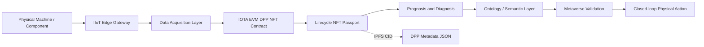

<div align="center">
  <h1>🚀 IOTA DPP NFT Lifecycle Management</h1>
  <p><b>Bridging Physical Manufacturing with Immutable Web3 Digital Twins</b></p>
  <p><i>A cutting-edge NFT-based lifecycle management layer for Semantic Integrated IIoT Manufacturing Systems.</i></p>
</div>

---

Welcome to the future of **Digital Product Passports (DPP)**. This repository houses a state-of-the-art **Web3 infrastructure** that securely binds physical manufacturing assets to immutable NFTs on the **IOTA EVM**. 

By leveraging decentralized storage (IPFS) and deterministic Smart Contracts, we provide a cryptographically secure, verifiable provenance layer. This architecture acts as the ultimate truth anchor across advanced industrial ecosystems—powering IIoT data acquisition, AI analytics, ontology/semantic reasoning, metaverse validation, and autonomous closed-loop execution. ⚡️

## Team

- Manikant Kumar
- Dhruv Maji
- Abhijeet Ranjan

## Project Position in the Main Workflow

| Layer | Main Project Responsibility | UFG NFT Lifecycle Link |
| --- | --- | --- |
| 1 | Physical manufacturing machines | Product, machine, and part NFTs represent the physical assets. |
| 2 | IIoT transformation | Edge gateway identifiers are attached to NFT metadata. |
| 3 | Data acquisition and management | Sensor batches and acquisition summaries are hashed and linked. |
| 4 | Streaming data to blockchain | Blockchain events anchor lifecycle checkpoints. |
| 5 | Web 3.0 prognosis and diagnosis | Analytics outputs become signed NFT metadata updates. |
| 6 | Ontology and semantic knowledge | OWL/RDF references are stored as semantic context URIs. |
| 7 | Metaverse validation | Digital twin validation results are recorded before physical action. |
| 8 | Autonomous closed-loop execution | Approved action records guide the next machine cycle. |

## What This Repository Provides

- ERC-721 Digital Product Passport smart contract for IOTA EVM.
- Lifecycle state machine for manufacturing assets.
- NFT categories for Product, Machine, Maintenance, Quality, Skill, Supply Chain, and Carbon records.
- IPFS-compatible JSON metadata schema for full lifecycle history.
- React TypeScript dApp scaffold for wallet connection, minting, and lifecycle updates.
- Architecture, integration, lifecycle, and roadmap documentation.
- Mermaid diagrams that can be rendered in GitHub or Markdown tooling.

## Architecture

The reference workflow image provided for the main project is stored at `assets/workflow-reference.jpeg`.



## Repository Layout

```text
apps/web/                 React TypeScript dApp scaffold
contracts/                Hardhat Solidity project for IOTA EVM
docs/                     Project design and integration documentation
diagrams/                 Mermaid architecture diagrams
schemas/                  JSON schema for DPP metadata
scripts/                  Metadata generation utilities
```

## Quick Start

1. Install dependencies:

```bash
npm install
```

2. Copy environment variables:

```bash
cp .env.example .env
```

3. Compile the smart contract:

```bash
npm run compile
```

4. Run contract tests:

```bash
npm test
```

5. Start the dApp:

```bash
npm run dev
```

## Smart Contract Summary

The contract in `contracts/contracts/ManufacturingLifecycleDPP.sol` implements:

- Role-based access control for foundry, OEM, MRO, quality, and regulator actors.
- Seven lifecycle stages: Raw Material, Manufacturing and Inspection, Quality Assurance, Supply Chain, In Service, Maintenance, and End of Life.
- Parent-child NFT linking for component bills of material.
- Immutable event logs for process, maintenance, quality, semantic, and metaverse validation records.
- End-of-life freeze behavior to prevent fraudulent re-entry of retired assets.

## Documentation

- [Project Scope](docs/project-scope.md)
- [System Architecture](docs/architecture.md)
- [Lifecycle Model](docs/lifecycle-model.md)
- [Metadata and Semantic Model](docs/metadata-and-semantics.md)
- [Main Project Integration](docs/main-project-integration.md)
- [Roadmap](docs/roadmap.md)
- [Demo Guide](docs/demo-guide.md)

## References

- IOTA documentation: https://docs.iota.org/
- IOTA EVM and IOTA product suite: https://www.iota.org/products/product-suite
- ERC-721 NFT standard: https://eips.ethereum.org/EIPS/eip-721
- OpenZeppelin contracts: https://docs.openzeppelin.com/contracts/
- IPFS: https://ipfs.tech/
