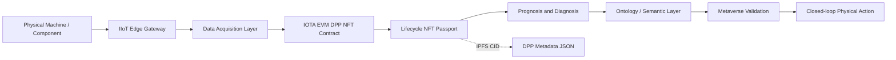

<div align="center">

<!-- Animated Header -->


<br/>

<!-- Animated Banner -->


<br/>

<!-- Badges -->


<p><b>Bridging Physical Manufacturing with Immutable Web3 Digital Twins</b></p>
<p><i>A cutting-edge NFT-based lifecycle management layer for Semantic Integrated IIoT Manufacturing Systems.</i></p>

</div>

---

Welcome to the future of **Digital Product Passports (DPP)**. This repository houses a state-of-the-art **Web3 infrastructure** that securely binds physical manufacturing assets to immutable NFTs on the **IOTA EVM**.

By leveraging decentralized storage (IPFS) and deterministic Smart Contracts, we provide a cryptographically secure, verifiable provenance layer. This architecture acts as the ultimate truth anchor across advanced industrial ecosystems—powering IIoT data acquisition, AI analytics, ontology/semantic reasoning, metaverse validation, and autonomous closed-loop execution. ⚡️

---

## ✨ Project Animation & Visual Overview

<div align="center">

<!-- Animated divider -->


<!-- NFT Lifecycle Chart -->


<p><i>🔄 NFT Lifecycle Stages — From Raw Material to End of Life on IOTA EVM</i></p>

<br/>

<!-- Architecture Graph -->


<p><i>🏗️ System Architecture — Physical IIoT Devices → IOTA EVM → NFT Digital Passport</i></p>


</div>

---

## 👥 Team

| Name | GitHub |
|------|--------|
| Manikant Kumar | [@manikantbindass](https://github.com/manikantbindass) |
| Abhijeet Ranjan | [@35qu4r3d](https://github.com/35qu4r3d) |
| Dhruv Maji | [@Dhruv4848I](https://github.com/Dhruv4848I) |

---

## 📊 Project Position in the Main Workflow

| Layer | Main Project Responsibility | UFG NFT Lifecycle Link |
| --- | --- | --- |
| 1 | Physical manufacturing machines | Product, machine, and part NFTs represent the physical assets. |
| 2 | IIoT transformation | Edge gateway identifiers are attached to NFT metadata. |
| 3 | Data acquisition and management | Sensor batches and acquisition summaries are hashed and linked. |
| 4 | Streaming data to blockchain | Blockchain events anchor lifecycle checkpoints. |
| 5 | Web 3.0 prognosis and diagnosis | Analytics outputs become signed NFT metadata updates. |
| 6 | Ontology and semantic knowledge | OWL/RDF references are stored as semantic context URIs. |
| 7 | Metaverse validation | Digital twin validation results are recorded before physical action. |
| 8 | Autonomous closed-loop execution | Approved action records guide the next machine cycle. |

---

## 🧩 What This Repository Provides

- ERC-721 Digital Product Passport smart contract for IOTA EVM.
- Lifecycle state machine for manufacturing assets.
- NFT categories for Product, Machine, Maintenance, Quality, Skill, Supply Chain, and Carbon records.
- IPFS-compatible JSON metadata schema for full lifecycle history.
- React TypeScript dApp scaffold for wallet connection, minting, and lifecycle updates.
- Architecture, integration, lifecycle, and roadmap documentation.
- Mermaid diagrams that can be rendered in GitHub or Markdown tooling.

---

## 🏛️ Architecture

The reference workflow image provided for the main project is stored at `assets/workflow-reference.jpeg`.



---

## 📁 Repository Layout

```text
apps/web/                 React TypeScript dApp scaffold
contracts/                Hardhat Solidity project for IOTA EVM
docs/                     Project design and integration documentation
diagrams/                 Mermaid architecture diagrams
schemas/                  JSON schema for DPP metadata
scripts/                  Metadata generation utilities
assets/                   Architecture graphs and reference images
```

---

## 🚀 Quick Start

1. Install dependencies:

```bash
npm install
```

2. Copy environment variables:

```bash
cp .env.example .env
```

3. Compile the smart contract:

```bash
npm run compile
```

4. Run contract tests:

```bash
npm test
```

5. Start the dApp:

```bash
npm run dev
```

---

## 📜 Smart Contract Summary

The contract in `contracts/contracts/ManufacturingLifecycleDPP.sol` implements:

- Role-based access control for foundry, OEM, MRO, quality, and regulator actors.
- Seven lifecycle stages: Raw Material, Manufacturing and Inspection, Quality Assurance, Supply Chain, In Service, Maintenance, and End of Life.
- Parent-child NFT linking for component bills of material.
- Immutable event logs for process, maintenance, quality, semantic, and metaverse validation records.
- End-of-life freeze behavior to prevent fraudulent re-entry of retired assets.

---

## 📚 Documentation

- [Project Scope](docs/project-scope.md)
- [System Architecture](docs/architecture.md)
- [Lifecycle Model](docs/lifecycle-model.md)
- [Metadata and Semantic Model](docs/metadata-and-semantics.md)
- [Main Project Integration](docs/main-project-integration.md)
- [Roadmap](docs/roadmap.md)
- [Demo Guide](docs/demo-guide.md)

---

## 🤝 Contributing

We welcome contributions! Here are the people who have contributed to this project:

<div align="center">

<table>
  <tr>
    <td align="center">
      <a href="https://github.com/manikantbindass">
        <br />
        <sub><b>Manikant Kumar</b></sub>
      </a><br />
      <a href="https://github.com/manikantbindass">@manikantbindass</a>
    </td>
    <td align="center">
      <a href="https://github.com/35qu4r3d">
        <br />
        <sub><b>Abhijeet Ranjan</b></sub>
      </a><br />
      <a href="https://github.com/35qu4r3d">@35qu4r3d</a>
    </td>
    <td align="center">
      <a href="https://github.com/Dhruv4848I">
        <br />
        <sub><b>Dhruv Maji</b></sub>
      </a><br />
      <a href="https://github.com/Dhruv4848I">@Dhruv4848I</a>
    </td>
  </tr>
</table>

</div>

---

## 🔗 References

- IOTA documentation: https://docs.iota.org/
- IOTA EVM and IOTA product suite: https://www.iota.org/products/product-suite
- ERC-721 NFT standard: https://eips.ethereum.org/EIPS/eip-721
- OpenZeppelin contracts: https://docs.openzeppelin.com/contracts/
- IPFS: https://ipfs.tech/

---

<div align="center">


<p>Made with ❤️ by the IOTA DPP Team</p>

</div>
