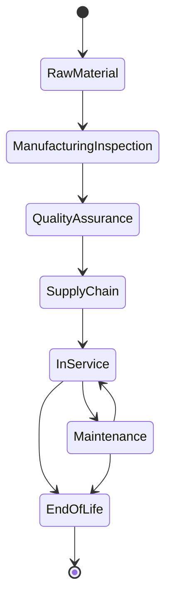

# Lifecycle Model

## NFT Categories

| NFT Kind | Purpose |
| --- | --- |
| Product NFT | Digital identity of manufactured component or assembly. |
| Machine NFT | Lifecycle history of machines and equipment. |
| Maintenance NFT | Immutable maintenance and repair records. |
| Quality NFT | Inspection, quality, and certification evidence. |
| Skill NFT | Operator skill and certification records. |
| Supply Chain NFT | Material provenance and custody chain. |
| Carbon NFT | Carbon footprint and sustainability records. |

## Lifecycle Stages

| Stage | Meaning |
| --- | --- |
| Raw Material | Material batch, heat number, supplier, and incoming inspection. |
| Manufacturing and Inspection | Manufacturing process steps and machine interactions. |
| Quality Assurance | NDT, dimensional inspection, certificate issue, and release. |
| Supply Chain | Shipment, custody transfer, and inventory update. |
| In Service | Active operational life and usage accumulation. |
| Maintenance | Repair, overhaul, restoration, or recalibration. |
| End of Life | Decommissioned, scrapped, recycled, or permanently retired. |

## Valid Transitions

The contract treats End of Life as terminal. Once an NFT reaches that state, metadata and lifecycle-changing operations are blocked.

